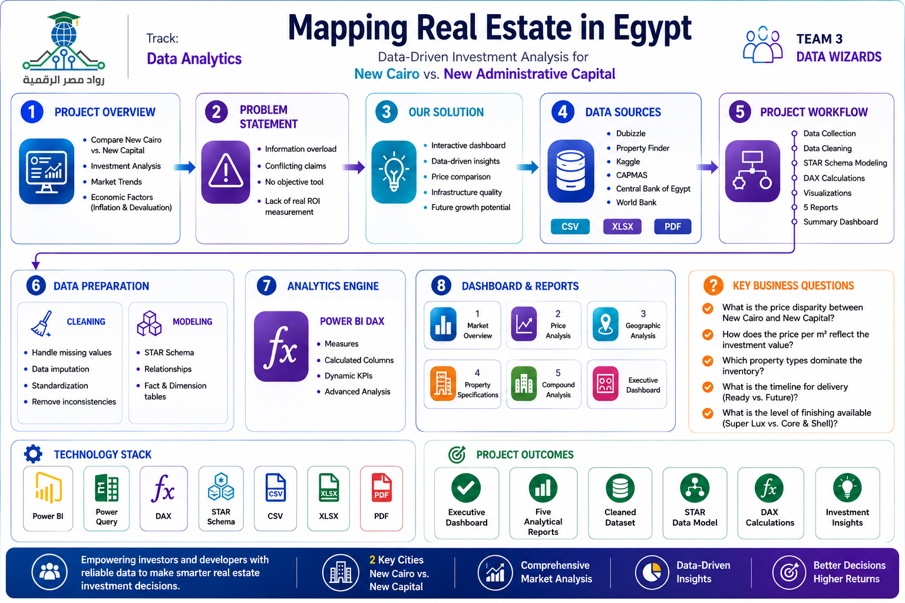

# 🏙️ Mapping Real Estate in Egypt

> A data-driven analysis project comparing real estate investment opportunities in **New Cairo** vs. the **New Administrative Capital** — built as a DEPI Graduation Project by Team 3: Data Wizards.

---

## 📌 Project Overview

The Egyptian real estate market is crowded with conflicting marketing claims and fragmented data, leaving investors without a clear, objective view of where their money truly works best. This project tackles that problem head-on by aggregating, cleaning, and modeling real estate listing data into an interactive Power BI dashboard that cuts through the noise.

The dashboard enables investors and developers to compare price trends, property specifications, infrastructure, and future growth potential across both cities — while factoring in economic realities like inflation and currency devaluation.

---

## 👥 Team

| Name | Role |
|---|---|
| Ahmed Wael | Team Leader |
| Furqan Sarhan | Member |
| Sara Ashraf | Member |
| Nourhan Safwat | Member |
| Marwa Ebrahim | Member |

---

## ❓ Problem Statement

Investors face **information overload** and contradictory marketing claims. There is a lack of an objective, data-backed tool to measure real Return on Investment (ROI) while accounting for economic factors like inflation and currency devaluation.

---

## 🎯 Key Questions Answered

- **Market Valuation & Pricing** — What is the price disparity between New Cairo and the New Administrative Capital? How does price per m² reflect investment value in each?
- **Supply & Inventory Composition** — Which property types dominate listings? How is inventory distributed between the two cities?
- **Delivery & Finishing Readiness** — What share of properties are Ready to Move vs. Future Delivery? What finishing levels (Super Lux, Core & Shell, etc.) characterize the current supply?

---

## 🗂️ Data Sources

| Source | Format |
|---|---|
| [Dubizzle Egypt](https://www.dubizzle.com.eg) — New Cairo & New Capital City listings | CSV / XLSX |
| [PropertyFinder Egypt](https://www.propertyfinder.eg) — New Cairo & New Capital City listings | XLSX |
| [Kaggle](https://www.kaggle.com) — Multiple Egyptian real estate datasets | CSV |
| [CAPMAS](https://www.capmas.gov.eg) — Official Egyptian statistics | PDF |
| [World Bank Group](https://www.worldbank.org) — Economic indicators | PDF |
| [Central Bank of Egypt](https://www.cbe.org.eg) — Currency & inflation data | PDF |

---

## ⚙️ Project Workflow

```
Sourcing → Cleaning → Modeling → DAX → Sample Visuals → Reports & Dashboard
```

1. **Sourcing** — Collected listings data from Dubizzle, PropertyFinder, and Kaggle, plus economic data from CAPMAS, World Bank, and the Central Bank of Egypt.
2. **Cleaning** — Applied data imputation techniques in Power Query to handle missing values, inconsistent types, and duplicate records.
3. **Modeling** — Built a Star Schema in Power BI, with `Real_Estate_Egypt` as the central fact table linked to dimension tables: `Locations`, `Property_Details`, and `Payment_Details`.
4. **DAX** — Wrote custom measures including Average Price, Price per SQM, % of Market, Price Index vs. City, and an IQR-based outlier detection flag.
5. **Reporting** — Delivered 5 focused reports + 1 summary dashboard.

---

## 📊 Reports & Dashboard

| Report | Focus |
|---|---|
| **Dashboard** | High-level summary — total listings, avg. price/SQM, unit size, property type distribution |
| **Report 1: Market Overview** | Avg. unit price, size distribution, finishing types, property offerings |
| **Report 2: Price Analysis** | Price per SQM by city, unit size, sale type, seller type, furnishing |
| **Report 3: Geographic Analysis** | Price by compound & city, property distribution, market composition by size |
| **Report 4: Property Specifications** | Unit type, bedroom count, size distribution, delivery timeline |
| **Report 5: Compound Analysis** | City distribution, finishing levels, floor-level breakdown |

### Key Dashboard Metrics (Across All Sources)
- **Total Listings:** 16,262
- **Avg. Price per SQM:** EGP 47,238
- **Avg. Unit Size:** 236 m²
- **Total Compounds:** 108
- **Property Type Count:** 17 types

---

## 🔍 Key Insights

- New Cairo commands a higher average unit price (~13M EGP) compared to the New Administrative Capital (~7M EGP), though the New Capital shows strong growth momentum.
- **Apartments** dominate supply in both cities; **Villas** are the second most common type.
- **Super Lux** is the leading finishing category at 41.2%, followed by Core & Shell at 25.7%.
- Market demand is family-driven — 3-bedroom, large/medium units account for the majority of listings.
- Listings have grown continuously year-over-year, reflecting a rapidly expanding market.
- Unfurnished units dominate, indicating buyers' preference for customization.
- Pricing is multifactorial — location, finishing, unit size, and seller type all interact to determine value.

---

## 🛠️ Tools & Technologies

- **Power BI** — Data modeling, DAX, and dashboard development
- **Power Query** — Data cleaning and transformation
- **Excel / CSV** — Raw data formats
- **DAX** — Custom measures (Avg Price, Price per SQM, Market Share %, Outlier Detection)
- **Star Schema** — Data modeling approach

---

## 📁 Repository Structure

```
├── data/
│   ├── raw/            # Original source files (CSV, XLSX)
│   └── cleaned/        # Processed datasets
├── powerbi/
│   └── RealEstate_Egypt.pbix   # Main Power BI report file
├── docs/
│   └── Mapping_Real_Estate_in_Egypt.pdf   # Project presentation
└── README.md
```

---

## 🚀 Getting Started

1. Clone this repository.
2. Open `powerbi/RealEstate_Egypt.pbix` in **Power BI Desktop**.
3. If needed, update data source paths under **Transform Data → Data Source Settings**.
4. Refresh the data and explore the dashboard.

---

*DEPI Graduation Project — Team 3: Data Wizards*
